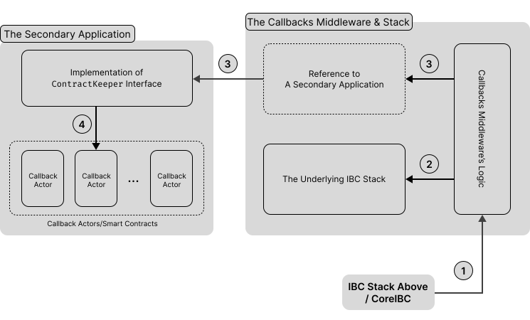
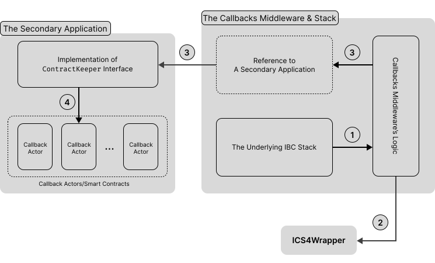

# Overview

Learn about what the Callbacks Middleware is, and how to build custom modules that utilize the Callbacks Middleware functionality {synopsis}

## What is the Callbacks Middleware?

IBC was designed with callbacks between core IBC and IBC applications. IBC apps would send a packet to core IBC, and receive a callback on every step of that packet's lifecycle. This allows IBC applications to be built on top of core IBC, and to be able to execute custom logic on packet lifecycle events (e.g. unescrow tokens for ICS-20).

This setup worked well for off-chain users interacting with IBC applications. However, we are now seeing the desire for secondary applications (e.g. smart contracts, modules) to call into IBC apps as part of their state machine logic and then do some actions on packet lifecycle events.

The Callbacks Middleware allows for this functionality by allowing the packets of the underlying IBC applications to register callbacks to secondary applications for lifecycle events. These callbacks are then executed by the Callbacks Middleware when the corresponding packet lifecycle event occurs.

After much discussion, the design was expanded to [an ADR](/architecture/adr-008-app-caller-cbs), and the Callbacks Middleware is an implementation of that ADR.

## Concepts

Callbacks Middleware was built with smart contracts in mind, but can be used by any secondary application that wants to allow IBC packets to call into it. Think of the Callbacks Middleware as a bridge between core IBC and a secondary application.

We have the following definitions:

- `Underlying IBC application`: The IBC application that is wrapped by the Callbacks Middleware. This is the IBC application that is actually sending and receiving packet lifecycle events from core IBC. For example, the transfer module, or the ICA controller submodule.
- `IBC Actor`: IBC Actor is an on-chain or off-chain entity that can initiate a packet on the underlying IBC application. For example, a smart contract, an off-chain user, or a module that sends a transfer packet are all IBC Actors.
- `Secondary application`: The application that is being called into by the Callbacks Middleware for packet lifecycle events. This is the application that is receiving the callback directly from the Callbacks Middleware module. For example, the `x/wasm` module.
- `Callback Actor`: The on-chain smart contract or module that is registered to receive callbacks from the secondary application. For example, a Wasm smart contract (gatekeeped by the `x/wasm` module). Note that the Callback Actor is not necessarily the same as the IBC Actor. For example, an off-chain user can initiate a packet on the underlying IBC application, but the Callback Actor could be a smart contract. The secondary application may want to check that the IBC Actor is allowed to call into the Callback Actor, for example, by checking that the IBC Actor is the same as the Callback Actor.
- `Callback Address`: Address of the Callback Actor. This is the address that the secondary application will call into when a packet lifecycle event occurs. For example, the address of the Wasm smart contract.
- `Maximum gas limit`: The maximum amount of gas that the Callbacks Middleware will allow the secondary application to use when it executes its custom logic.
- `User defined gas limit`: The amount of gas that the IBC Actor wants to allow the secondary application to use when it executes its custom logic. This is the gas limit that the IBC Actor specifies when it sends a packet to the underlying IBC application. This cannot be greater than the maximum gas limit.

Think of the secondary application as a bridge between the Callbacks Middleware and the Callback Actor. The secondary application is responsible for executing the custom logic of the Callback Actor when a packet lifecycle event occurs. The secondary application is also responsible for checking that the IBC Actor is allowed to call into the Callback Actor.

Note that it is possible that the IBC Actor, Secondary Application, and Callback Actor are all the same entity. In which case, the Callback Address should be the secondary application's module address.

The following diagram shows how a typical `RecvPacket`, `AcknowledgementPacket`, and `TimeoutPacket` execution flow would look like:

And the following diagram shows how a typical `SendPacket` and `WriteAcknowledgement` execution flow would look like:

## Known Limitations

- Callbacks are always executed after the underlying IBC application has executed its logic.
- Maximum gas limit is hardcoded manually during wiring. It requires a coordinated upgrade to change the maximum gas limit.
- The receive packet callback does not pass the relayer address to the secondary application. This is so that we can use the same callback for both synchronous and asynchronous acknowledgements.
- The receive packet callback does not pass IBC Actor's address, this is because the IBC Actor lives in the counterparty chain and cannot be trusted.
